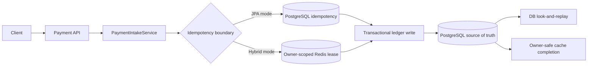

# Infra

Executable architecture case studies for backend infrastructure, distributed systems,
and engineering judgment under failure.

Every material claim in this repository is expected to map to running code, an executable
test, an operational procedure, or an explicitly documented limitation.

## Featured Case Study

### Idempotent Payment Ledger

[Explore the module](system-design/idempotent-payment-ledger/) | [Design](system-design/idempotent-payment-ledger/docs/DESIGN_DOC.md) | [Failure modes](system-design/idempotent-payment-ledger/docs/FAILURE_MODES.md) | [Operations runbook](system-design/idempotent-payment-ledger/docs/OPERATIONS_RUNBOOK.md)

A completed v1 case study for retry-safe payment intake and double-entry ledger mutation.
It addresses a difficult boundary in payment systems: a client can time out without knowing
whether the server committed, then retry while another request or application instance is
still processing the same logical payment.

The core invariant is:

```text
One logical payment attempt maps to one accepted payment outcome and one balanced
ledger transaction, regardless of client retries or concurrent delivery.
```

#### System Shape



PostgreSQL is authoritative in both runtime modes. Redis is an optional perimeter that
reduces duplicate pressure; it never replaces database uniqueness or transaction safety.

#### What Is Implemented

| Engineering concern | Implemented boundary |
|---|---|
| Retry ambiguity | Stable idempotency keys bind one accepted payload and replay the stored outcome. |
| Concurrent duplicate delivery | PostgreSQL uniqueness on `(tenant_id, idempotency_key)` resolves competing writers to one payment and one replay. |
| Expiring distributed reservations | Redis leases carry random owner tokens; Lua compare-and-set/delete prevents a stale owner from mutating a replacement lease. |
| Double spending | Payer and merchant accounts are locked in deterministic order with `SELECT FOR UPDATE`; overdraft is rejected and reinforced by a non-negative balance constraint. |
| Ledger correctness | Payment, account mutation, ledger transaction, and balanced debit/credit entries commit under one PostgreSQL transaction. |
| Cache failure after commit | Redis completion runs after database commit; PostgreSQL look-and-replay reconstructs a missing cache outcome. |
| Migration safety | Flyway V3 uniqueness rollout has a pre-flight procedure; V4 cleanup preserves accounts referenced by historical ledger entries. |
| Operations | Domain metrics, failure-mode analysis, reconciliation queries, rollout guidance, and owner-safe intervention procedures are documented. |

#### Failure Evidence

The module exercises failure paths against PostgreSQL 16 and Redis 7 through Testcontainers,
without an H2 fallback.

| Scenario under test | Expected evidence |
|---|---|
| Two database writers race on the same key | One durable payment; the loser returns the winner as a replay. |
| Ten concurrent debits exceed the available balance | Exactly the affordable payments commit; the account never becomes negative. |
| Database transaction rolls back | Redis is never published as `ACCEPTED`. |
| Database commits but Redis completion fails | The durable payment survives and the next retry repairs the cache through DB replay. |
| A Redis lease expires and a new owner acquires it | The stale owner can neither delete nor complete over the replacement owner. |
| V4 runs over a V3 database with ledger history | Referenced accounts survive; only unused fixture accounts are removed. |

Current verification:

```text
Module suite: 32 tests, 0 failures, 0 errors, 0 skipped
Full Maven reactor: pass
Docker Compose validation: pass
```

#### Review Surface

- [Module README](system-design/idempotent-payment-ledger/README.md): invariants, runtime profiles, commands, test matrix, and explicit gaps.
- [Design document](system-design/idempotent-payment-ledger/docs/DESIGN_DOC.md): consistency model, transaction boundaries, alternatives, and trade-offs.
- [ADR-001](system-design/idempotent-payment-ledger/docs/ADR-001-persistence-schema.md): PostgreSQL persistence and authoritative correctness boundary.
- [ADR-002](system-design/idempotent-payment-ledger/docs/ADR-002-redis-reservation-ownership.md): owner-scoped leases and atomic Redis transitions.
- [Failure modes](system-design/idempotent-payment-ledger/docs/FAILURE_MODES.md): expected behavior paired with executable evidence.
- [Operations runbook](system-design/idempotent-payment-ledger/docs/OPERATIONS_RUNBOOK.md): diagnosis, reconciliation, migration rollout, and safe intervention.
- [Gate checklist](system-design/idempotent-payment-ledger/GATE_CHECKLIST.md): completed evidence and intentionally deferred scope.

The v1 closure boundary is explicit. Transactional outbox delivery, authentication and
tenant isolation, measured capacity, and a durable reconciliation worker are deferred
extensions rather than implied capabilities.

## Infrastructure Bricks

Smaller runnable modules isolate reusable mechanics that support larger designs:

| Module | Implemented focus |
|---|---|
| [`brick/cdn-edge-cache`](brick/cdn-edge-cache/) | Spring Boot origin with an Nginx edge, cache policy, WAF sample, rate limiting, and HIT/MISS signals. |
| [`brick/circuit-breaker`](brick/circuit-breaker/) | Resilience4j around a real HTTP client, typed failure classification, ordered fallback, and Actuator/Micrometer signals. |
| [`brick/rate-limiter`](brick/rate-limiter/) | Per-client token bucket admission, immediate rejection, rate-limit headers, and Actuator metrics. |

## Engineering Standard

A module is useful only when a reviewer can trace:

```text
invariant -> boundary -> implementation -> executable failure proof
          -> operational response -> residual risk
```

The public evidence surface is selected according to the module's risk:

- `README.md` for the problem, guarantees, commands, evidence, and gaps;
- `docs/DESIGN_DOC.md` for requirements, consistency, alternatives, and trade-offs;
- ADRs for decisions that should remain stable and reviewable;
- `docs/FAILURE_MODES.md` for concrete failure scenarios and current proof;
- `docs/OPERATIONS_RUNBOOK.md` when safe operation requires explicit procedures;
- `GATE_CHECKLIST.md` for evidence status and deferred scope.

## Stack

- Java 21
- Spring Boot 4.0.6
- Maven Wrapper 3.9.9
- PostgreSQL 16 and Flyway
- Redis 7
- Testcontainers
- Resilience4j, Micrometer, Actuator, and Prometheus export where relevant
- Docker Compose and Nginx where the runtime topology requires them

## Build

Docker must be running because persistence tests use real PostgreSQL and Redis containers.

Run the full reactor:

```bash
./mvnw clean test
```

Run the featured module:

```bash
./mvnw -pl system-design/idempotent-payment-ledger clean test
```

Runtime profiles and local seed instructions are documented in the
[module README](system-design/idempotent-payment-ledger/README.md).
