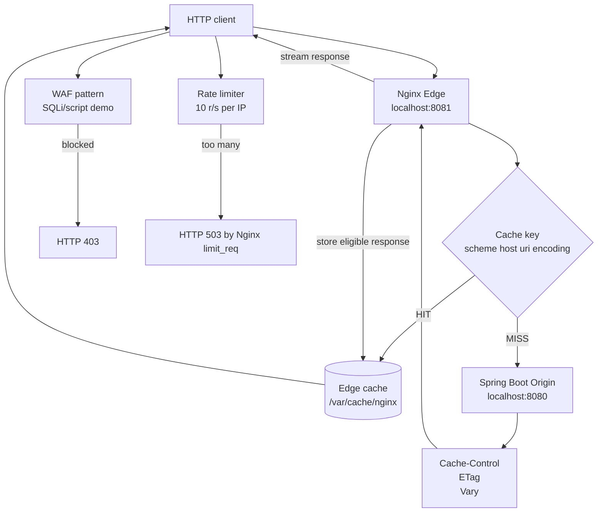

# CDN Edge Cache

Track: `brick`

Canonical brick for the mechanics behind a Content Delivery Network: a Spring Boot Origin protected by an Nginx Edge reverse proxy with HTTP caching, TTLs, cache keys, cache locking, simple WAF rules, and rate limiting.

The bar for this module is evidence, not labels: every operational claim below is either implemented in code/config, covered by tests, or explicitly listed as a production gap.

## Problem

Global users should not fetch the same static or semi-static content from the Origin on every request. Without an Edge cache, the Origin pays for repeated bandwidth, connection setup, CPU, and long-haul network latency. Under a traffic spike, many simultaneous misses can also amplify load back into the Origin.

This brick demonstrates the split:

- the **Origin** owns business behavior and emits HTTP cache policy;
- the **Edge** terminates client traffic, checks a cache key, serves hits locally, and pulls from Origin on misses;
- state-changing requests bypass cache and flow to the Origin;
- perimeter controls reject obvious abuse before it reaches the Origin.

## Design Invariants

- Spring Boot is the Origin, not the Edge.
- Nginx is the Edge reverse proxy and shared cache.
- Cache keys are derived from scheme, host, request URI, and `Accept-Encoding`.
- Immutable static assets use long TTLs and versioned filenames.
- Semi-static API responses use short TTLs plus `stale-while-revalidate`.
- `POST /api/checkout` is never stored by shared caches.
- `proxy_cache_lock` prevents many concurrent misses for the same key from stampeding the Origin.
- The Edge adds `X-Cache-Status` so HIT/MISS behavior is observable.
- Simple WAF and rate-limit rules live at the Edge to demonstrate perimeter protection.

## Runtime Flow



## Implemented Endpoints

Run the Origin only:

```bash
./mvnw -pl brick/cdn-edge-cache spring-boot:run
curl -i "http://localhost:8080/assets/app.8f3a1c.js"
curl -i "http://localhost:8080/api/products/42"
curl -i -X POST "http://localhost:8080/api/checkout"
```

Run Origin plus Edge:

```bash
./mvnw -pl brick/cdn-edge-cache package
cd brick/cdn-edge-cache
docker compose up --build
```

Then verify cache behavior through the Edge:

```bash
curl -I "http://localhost:8081/assets/app.8f3a1c.js"
curl -I "http://localhost:8081/assets/app.8f3a1c.js"
```

The first response should show `X-Cache-Status: MISS`; the second should show `X-Cache-Status: HIT`.

Verify short-lived API caching:

```bash
curl -i "http://localhost:8081/api/products/42"
curl -i "http://localhost:8081/api/products/42"
curl -i "http://localhost:8081/api/products/42?nocache=1"
```

Verify that state-changing traffic bypasses shared cache:

```bash
curl -i -X POST "http://localhost:8081/api/checkout"
```

Verify the simple WAF rule:

```bash
curl -i "http://localhost:8081/api/products/42?q=union%20select"
```

## Cache Policy

| Path | Owner | Cache behavior |
|---|---|---|
| `/assets/app.8f3a1c.js` | Origin + Edge | `Cache-Control: public, max-age=31536000, immutable`; Edge caches for 365 days. |
| `/assets/index.html` | Origin + Edge | `Cache-Control: public, max-age=30, stale-while-revalidate=300`; Edge caches for 30 seconds. |
| `/api/products/{id}` | Origin + Edge | `Cache-Control: public, max-age=60, stale-while-revalidate=600`; Edge caches for 60 seconds. |
| `/api/checkout` | Origin only | `Cache-Control: no-store`; Edge bypasses cache. |

## Test Matrix

Covered by `OriginCacheHeaderIntegrationTest`:

- immutable asset emits long-lived `Cache-Control`, `ETag`, and `Vary: Accept-Encoding`;
- cacheable API emits short TTL and `stale-while-revalidate`;
- checkout endpoint emits `Cache-Control: no-store`.

`CdnEdgeCacheApplicationTests` verifies Spring context wiring.

Nginx HIT/MISS behavior is a runtime smoke check because it depends on the Dockerized Edge process.

## Production Gaps

- This demo uses one local Nginx Edge. A real CDN has many PoPs, Anycast/GeoDNS, health-aware routing, and a control plane.
- Nginx Open Source does not provide a built-in global purge API. This demo favors immutable filename cache busting and `nocache=1` bypass for learning.
- WAF detection is intentionally tiny. Production WAFs use managed rules, positive security models, tuned exclusions, and staged rollout.
- Rate limiting is local to one Edge node. A real distributed limiter needs a policy plane and shared or carefully partitioned counters.
- TLS termination is omitted for local clarity. Real Edge traffic should terminate HTTPS and manage certificates.
- Logs are local Nginx logs only. Production requires distributed tracing, Edge/Origin correlation IDs, dashboards, and alerts.

## Architectural Doctrine

**The Invariant of Edge Caching:** *Move bytes and rejection decisions to the perimeter; keep source-of-truth mutation and deep business state at the Origin.*

The Edge is powerful when it can decide from the request and cache metadata. The Origin remains the authority for writes, transactions, and complex state.

---
One sentence to trigger the reflex: **"Cache the body at the border, keep the truth at the source."**
