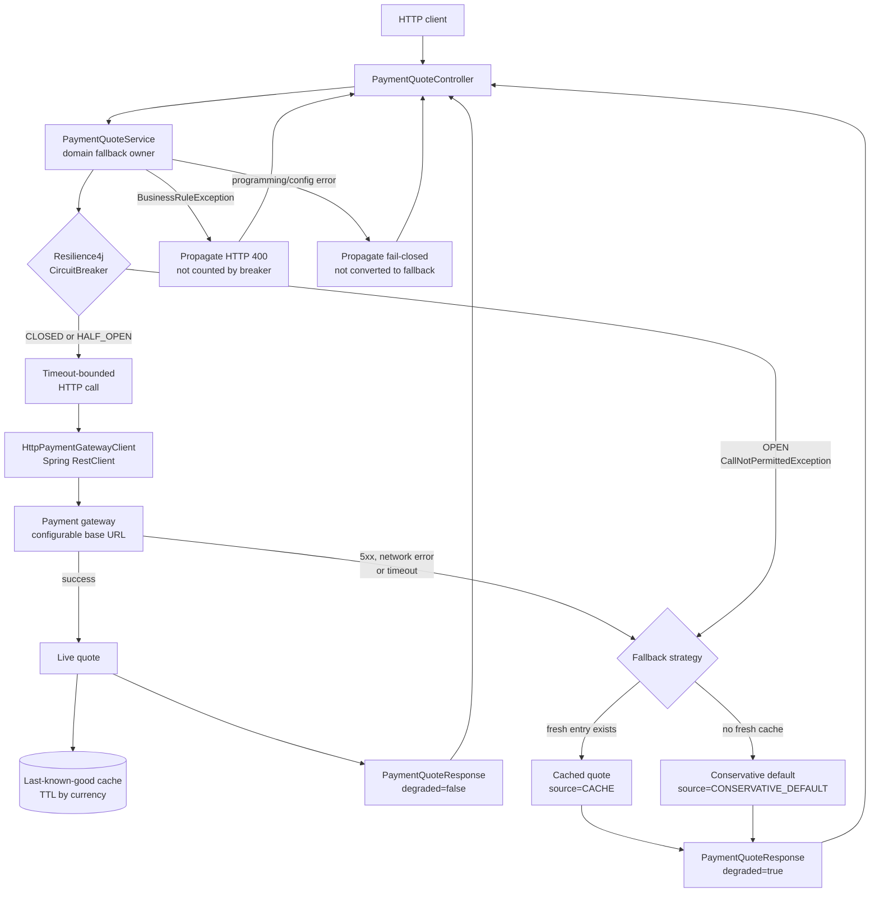

# Circuit Breaker

Track: `brick`

Canonical Spring Boot brick for protecting an outbound HTTP dependency with Resilience4j CircuitBreaker. The demo models a payment quote service calling a configurable payment gateway over Spring `RestClient`.

The bar for this module is evidence, not labels: every operational claim below is either implemented in code, covered by tests, or explicitly listed as a production gap.

## Problem

Outbound dependencies fail in ways local code does not:

- they can return transient downstream errors;
- they can become slow enough to pin caller threads;
- repeated calls to an unhealthy dependency can amplify an incident;
- fallback data can become unsafe when it never expires;
- business errors can pollute infrastructure health if failures are not classified.

The service boundary must protect the caller, avoid increasing pressure on a failing dependency, and return degradation explicitly instead of hiding it.

## Design Invariants

- The breaker wraps the outbound gateway call only. Domain validation stays outside the protected dependency boundary.
- `RemotePaymentGatewayException` is the only expected downstream failure class recorded by the breaker.
- `BusinessRuleException` is a business failure. It propagates and is ignored by breaker accounting.
- `IllegalArgumentException` and `IllegalStateException` represent caller, programming, or configuration errors. They propagate and are ignored by breaker accounting.
- An `OPEN` circuit skips the remote call and increments not-permitted-call metrics.
- Every fallback response sets `degraded=true` and a concrete `QuoteSource`.
- Last-known-good fallback entries expire by TTL.
- The gateway client uses real HTTP connect/read timeouts plus a service-level timeout budget.
- Circuit breaker health and Micrometer/Prometheus metrics are implemented, not just documented.
- The README does not claim endpoints, metrics, or behavior that are not present in code.

## Runtime Flow



```text
HTTP request
  -> PaymentQuoteController
       -> PaymentQuoteService
       -> Resilience4j CircuitBreaker
       -> timeout-bounded HTTP call
       -> HttpPaymentGatewayClient
       -> configurable payment gateway base URL
            success: cache last-known-good quote
            RemotePaymentGatewayException: fallback
            CallNotPermittedException: fallback without remote call
            BusinessRuleException: propagate as HTTP 400
            programming/config error: propagate
```

Fallback order:

1. Fresh last-known-good quote by currency.
2. Conservative default fee: `max(amount * 3.5%, 1.00)`.
3. Fail closed for business, caller, programming, and configuration errors by propagating the exception.

## Failure Taxonomy

| Failure type | Example | Breaker accounting | User-facing behavior |
|---|---|---:|---|
| Downstream failure | timeout, gateway 5xx, connection failure represented as `RemotePaymentGatewayException` | recorded | degraded quote from cache/default |
| Open circuit | `CallNotPermittedException` | not-permitted count increases | degraded quote from cache/default without remote call |
| Business rule | invalid amount, ineligible business request | ignored | exception propagates; HTTP 400 for `BusinessRuleException` |
| Programming/config error | bad client setup, invalid local state | ignored | exception propagates; no fallback masking |
| Slow success | call succeeds after slow-call threshold | recorded as slow call | response succeeds; breaker may open after threshold |

## Implemented Endpoints

Run:

```bash
./mvnw -pl brick/circuit-breaker spring-boot:run
```

Try:

```bash
curl "http://localhost:8080/api/payment-quotes?amount=100.00&currency=USD"
curl "http://localhost:8080/api/circuit-breaker/payment-gateway"
curl "http://localhost:8080/actuator/health"
curl "http://localhost:8080/actuator/metrics"
curl "http://localhost:8080/actuator/metrics/resilience4j.circuitbreaker.buffered.calls"
curl "http://localhost:8080/actuator/prometheus"
```

`/api/circuit-breaker/payment-gateway` is implemented by the application and returns breaker name, state, failure rate, slow-call rate, buffered calls, failed calls, and not-permitted calls.

Actuator `health`, `info`, `metrics`, and `prometheus` are exposed by configuration. The `paymentGateway` health contributor reports `OUT_OF_SERVICE` when the circuit is `OPEN`; otherwise it reports `UP` with breaker details. Custom Micrometer gauges export breaker failure rate, slow-call rate, buffered calls, failed calls, not-permitted calls, and state.

OpenTelemetry export, dashboards, and alert rules are recommended production follow-ups, not implemented here.

## Configuration

```yaml
infra:
  circuit-breaker:
    payment-gateway:
      name: payment-gateway
      failure-rate-threshold: 50
      slow-call-rate-threshold: 50
      slow-call-duration-threshold: 500ms
      sliding-window-size: 10
      minimum-number-of-calls: 5
      permitted-calls-in-half-open-state: 3
      wait-duration-in-open-state: 10s
      remote-call-timeout: 300ms
      fallback-cache-ttl: 5m
      base-url: http://localhost:9090
      connect-timeout: 200ms
      read-timeout: 250ms
```

Rationale:

- Count-based windows keep the demo and tests deterministic.
- `minimum-number-of-calls` avoids opening the breaker on a single unlucky request.
- `failure-rate-threshold` and `slow-call-rate-threshold` are separate because a successful but slow dependency can still harm the caller.
- `connect-timeout` and `read-timeout` belong to the HTTP client; they keep socket behavior bounded.
- `remote-call-timeout` is the service-level budget around the entire protected dependency call.
- `fallback-cache-ttl` prevents stale payment quotes from living forever.
- `base-url` makes the gateway replaceable in tests and environments.

## Test Matrix

Covered by `PaymentQuoteServiceTest`:

- open circuit does not call the remote gateway again;
- cached fallback after successful quote then downstream failure;
- conservative default when no cache exists;
- expired cache is not used;
- `BusinessRuleException` is not counted as downstream failure;
- programming/config error propagates and is not converted to fallback;
- half-open recovery closes the circuit after a successful probe;
- timeout is treated as downstream failure and falls back;
- slow successful calls can open the circuit when the slow-call threshold is reached.

Covered by `PaymentQuoteIntegrationTest`:

- the API calls a real HTTP gateway through Spring `RestClient`;
- breaker state endpoint returns live state after an HTTP-backed quote;
- Actuator health includes the `paymentGateway` contributor;
- Micrometer metrics are available through `/actuator/metrics`;
- Prometheus export is available through `/actuator/prometheus`;
- when the upstream returns 503 enough times to open the circuit, health becomes `OUT_OF_SERVICE`;
- after the circuit opens, additional requests do not call the upstream again.

`CircuitBreakerApplicationTests` verifies Spring context wiring.

## Operational Notes

- Sustained `OPEN` state and rising not-permitted calls should page or create an incident depending on product criticality.
- Tune thresholds from production traffic volume, upstream latency distribution, and tolerance for stale/default quotes.
- Add retries only when the operation is idempotent and retry budgets are explicit.
- Add bulkheads or connection-pool isolation before using this pattern on high-volume blocking I/O.
- Protect Actuator endpoints with authentication/authorization before exposing this outside a local environment.
- Decide whether conservative defaults are legally and financially acceptable for the specific payment domain before enabling them in production.

## Production Gaps

- The gateway contract is intentionally small: `GET /quotes` returns `networkFee` and `reason`. Real systems need schema/versioning, auth, TLS, and error-body mapping.
- The executor timeout cancels a `Future`; the HTTP client also has connect/read timeouts, but high-volume production traffic should still add bulkhead or connection pool isolation.
- The fallback cache is in-memory only. Multi-instance deployments need an explicit consistency strategy.
- Prometheus metrics are exported, but alert thresholds, dashboards, runbooks, and SLO-based tuning are intentionally not implemented here.
- OpenTelemetry export and distributed tracing are not implemented.
