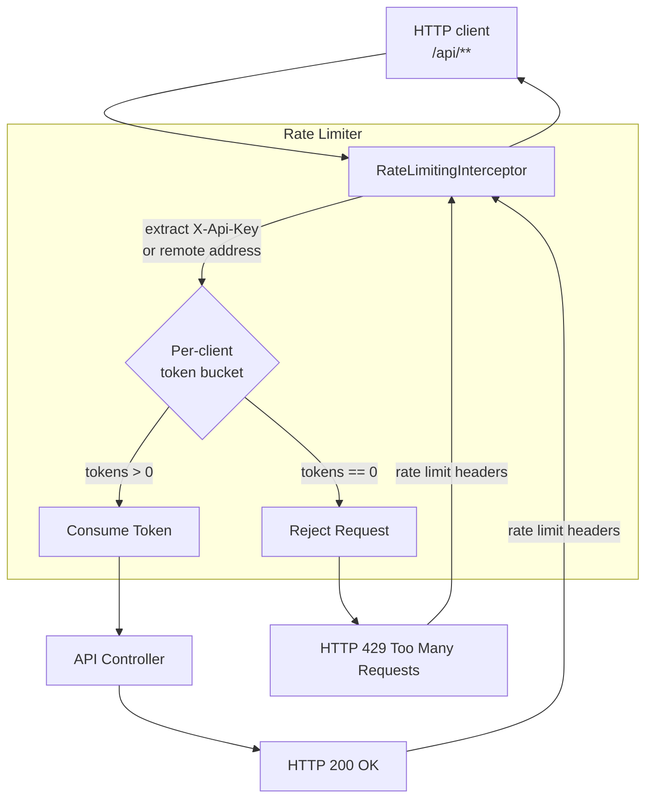

# Rate Limiter

Track: `brick`

Canonical Spring Boot brick for server-side rate limiting. This demo models a per-client token-bucket limiter for a hypothetical API.

The bar for this module is evidence, not labels: every operational claim below is either implemented in code, covered by tests, or explicitly listed as a production gap.

## Problem

Public or heavily-used APIs must protect themselves and their downstream dependencies from being overwhelmed by traffic. Unchecked, a spike in requests from a single client or a distributed attack can lead to:

- Resource exhaustion (CPU, memory, threads, file descriptors).
- Increased latency for all clients.
- Downstream service failures, causing cascading outages.
- Higher operational costs.

A rate limiter acts as a control valve, ensuring that the server handles a sustainable number of requests.

## Design Invariants

- **Per-Client State:** The limit is keyed by `X-Api-Key` when present and falls back to the remote address.
- **Token Bucket Algorithm:** Each client receives an independent token bucket with configurable capacity, refill amount, and refill period.
- **Reject, Don't Queue:** When the bucket is empty, the request is rejected immediately with `HTTP 429 Too Many Requests`.
- **Clear Feedback:** Every response includes `X-RateLimit-Limit`, `X-RateLimit-Remaining`, and `X-RateLimit-Reset` headers.
- **Observability is Key:** Active buckets and allowed, rejected, and created-bucket counters are exposed through Actuator metrics.
- **Configuration Driven:** Bucket capacity, refill policy, bucket TTL, and client header are externalized.
- **Control Plane Safety:** The limiter applies to `/api/**`; Actuator remains reachable for health and metrics.

## Runtime Flow



## Failure Taxonomy

| Scenario | Mechanism | Client-Facing Behavior | Server-Side Metrics |
|---|---|---|---|
| Sufficient tokens | Request is allowed to proceed. | `HTTP 200 OK`; `X-RateLimit-Remaining` is decremented. | `rate.limiter.allowed.requests` counter increments. |
| Insufficient tokens | Request is immediately rejected. | `HTTP 429 Too Many Requests`; `X-RateLimit-Reset` points to the next refill. | `rate.limiter.rejected.requests` counter increments. |
| First request from client | A new token bucket is created for that client. | `HTTP 200 OK`; `X-RateLimit-Remaining` is `capacity - 1`. | `rate.limiter.buckets.created` counter increments. |
| Idle client | Bucket is evicted after `bucket-ttl`. | Next request creates a fresh bucket. | `rate.limiter.active.buckets` decreases after eviction. |

## Implemented Endpoints

Run:

```bash
./mvnw -pl brick/rate-limiter spring-boot:run
```

Try:

```bash
curl -i -H "X-Api-Key: client-a" "http://localhost:8080/api/time"
curl -i "http://localhost:8080/actuator/metrics/rate.limiter.active.buckets"
curl -i "http://localhost:8080/actuator/metrics/rate.limiter.allowed.requests"
curl -i "http://localhost:8080/actuator/metrics/rate.limiter.rejected.requests"
curl -i "http://localhost:8080/actuator/metrics/rate.limiter.buckets.created"
```

## Configuration

```yaml
infra:
  brick:
    rate-limiter:
      name: api
      capacity: 5
      refill-tokens: 5
      refill-period: 1m
      bucket-ttl: 10m
      client-id-header: X-Api-Key
```

Rationale:

- `capacity` defines burst tolerance.
- `refill-tokens` and `refill-period` define the steady-state admission rate.
- `bucket-ttl` prevents inactive in-memory client buckets from living forever.
- `client-id-header` lets the limiter move from IP-based demos toward API-key or user-based limits.

## Test Matrix

Covered by `RateLimiterIntegrationTest`:

- an allowed request returns `HTTP 200` with rate-limit headers;
- the sixth request for one client returns `HTTP 429` when capacity is five;
- a second client receives an independent bucket;
- Actuator exposes custom limiter metrics.

## Production Gaps

- **In-Memory State:** This implementation stores token buckets in-process. Multi-instance deployments need Redis, Hazelcast, or another shared backend to enforce a global limit.
- **Client Identity Trust:** Header-based client identity is convenient for the demo. Production systems should extract identity from authenticated API keys, JWT claims, mTLS, or trusted edge metadata.
- **Static Configuration:** The same rate limit applies to all clients. A production system often needs policy tiers loaded from config, a database, or an entitlement service.
- **Local Eviction Only:** Idle bucket TTL prevents unbounded local growth, but production eviction should be coordinated with the chosen distributed backend.
- **Alerting & Dashboards:** Metrics are exported, but alert thresholds, dashboards, and runbooks are intentionally not implemented here.

## Architectural Doctrine

**The Invariant of Admission Control:** *A system's stability is not determined by its peak capacity, but by its ability to shed load gracefully when that capacity is breached.* 

In a flash sale or high-concurrency event, the Rate Limiter is the "breakwater" that protects the core database and internal services. By using a Token Bucket at the perimeter, we transform a potential system-wide outage into a controlled experience for admitted users and a clear backoff signal for those rejected.

---
🪷 *One sentence to trigger the reflex*: **"Don't try to absorb the tsunami; build a breakwater, and let only the ripples touch your database."**
