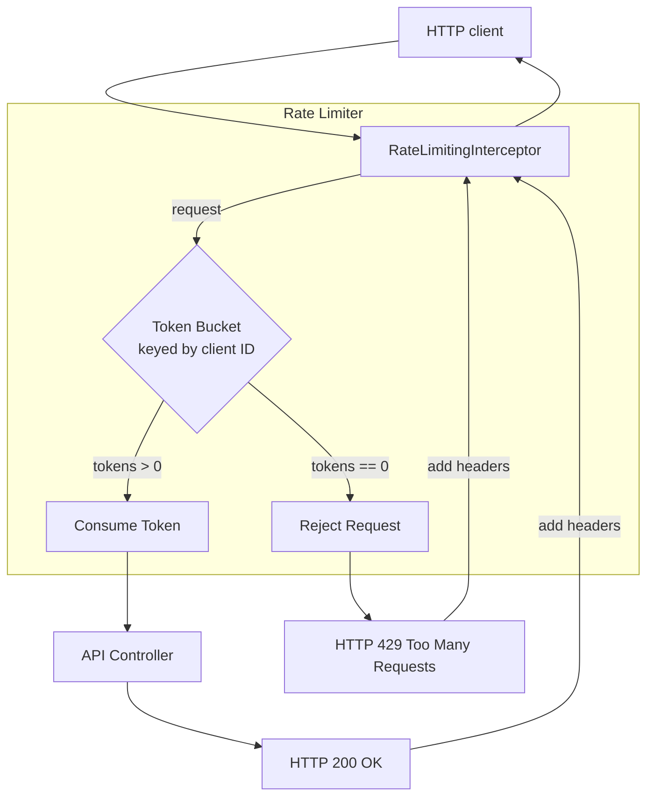

# Rate Limiter

Track: `brick`

Canonical Spring Boot brick for server-side rate limiting. This demo models a token-bucket limiter for a hypothetical API.

The bar for this module is evidence, not labels: every operational claim below is either implemented in code, covered by tests, or explicitly listed as a production gap.

## Problem

Public or heavily-used APIs must protect themselves and their downstream dependencies from being overwhelmed by traffic. Unchecked, a spike in requests from a single client or a distributed attack can lead to:

- Resource exhaustion (CPU, memory, threads, file descriptors).
- Increased latency for all clients.
- Downstream service failures, causing cascading outages.
- Higher operational costs.

A rate limiter acts as a control valve, ensuring that the server handles a sustainable number of requests.

## Design Invariants

- **Per-Client State:** The rate limit is applied on a per-client basis (e.g., by IP address, API key, or user ID). Global, un-keyed limiting is a much simpler case and not the focus here.
- **Token Bucket Algorithm:** The core logic uses a token bucket, which allows for controlled bursts of traffic while maintaining a steady average rate. This is a common and flexible choice.
- **Reject, Don't Queue:** When the limit is exceeded, the request is rejected immediately with an `HTTP 429 Too Many Requests` status. We do not queue requests on the server, as this can lead to resource exhaustion.
- **Clear Feedback:** The `HTTP 429` response includes headers (`X-RateLimit-Limit`, `X-RateLimit-Remaining`, `X-RateLimit-Reset`) to provide clear feedback to the client, allowing them to implement backoff strategies.
- **Observability is Key:** The limiter's state (e.g., remaining tokens, rejected requests) is exposed as metrics for monitoring and alerting.
- **Configuration Driven:** Key parameters of the token bucket (bucket size, refill rate) are externalized and can be changed without a code deployment.

## Runtime Flow

## Failure Taxonomy

| Scenario | Mechanism | Client-Facing Behavior | Server-Side Metrics |
|---|---|---|---|
| Sufficient Tokens | Request is allowed to proceed. | `HTTP 200 OK`. `X-RateLimit-Remaining` header is decremented. | `rate.limiter.allowed.requests` counter increments. |
| Insufficient Tokens | Request is immediately rejected. | `HTTP 429 Too Many Requests`. `X-RateLimit-Reset` header indicates when new tokens will be available. | `rate.limiter.rejected.requests` counter increments. |
| First Request | A new token bucket is created for the client. | `HTTP 200 OK`. `X-RateLimit-Remaining` is `capacity - 1`. | `rate.limiter.buckets.created` counter increments. |

## Production Gaps

- **In-Memory State:** This implementation uses a simple in-memory `Map` to store token buckets. This is **not suitable for production** as it is not shared across multiple instances of the service. A real-world implementation would require a distributed backend like Redis or Hazelcast to ensure consistency.
- **Client Identification:** The client identifier is currently hardcoded. A production system would need a robust mechanism to extract a client ID from the request (e.g., from an API key in a header, a JWT, or the source IP address).
- **Static Configuration:** The rate limit configuration is the same for all clients. A more advanced system might support different rate limit tiers (e.g., "free" vs. "paid" users) loaded from a database or configuration service.
- **Eviction Policy:** The in-memory map of buckets will grow indefinitely. A production implementation needs an eviction policy (e.g., LRU, TTL) to remove buckets for clients that have not been seen recently.
- **Alerting & Dashboards:** Metrics are exported, but alert thresholds, dashboards, and runbooks are intentionally not implemented here.

## 🏛️ Architectural Doctrine

**The Invariant of Admission Control:** *A system's stability is not determined by its peak capacity, but by its ability to shed load gracefully when that capacity is breached.* 

In a flash sale or high-concurrency event, the Rate Limiter is the "breakwater" that protects the core database and internal services. By using a Token Bucket at the perimeter, we transform a potential system-wide outage into a controlled experience for admitted users and a clear backoff signal for those rejected.

---
🪷 *One sentence to trigger the reflex*: **"Don't try to absorb the tsunami; build a breakwater, and let only the ripples touch your database."**
