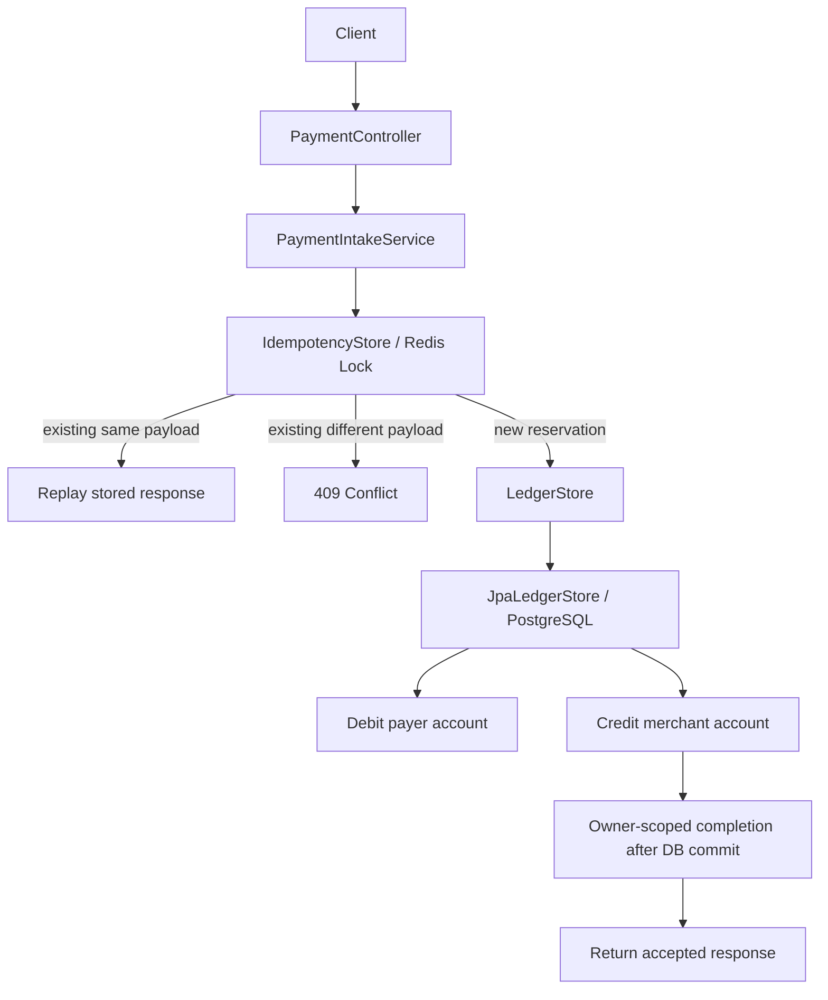

# Design Doc: Idempotent Payment Ledger

## Problem Statement

Clients retry payment requests when networks, gateways, or servers fail ambiguously. A retry can arrive after the original request already mutated state. Without an idempotency boundary, the system can double-charge a payer or create duplicate ledger entries.

This module demonstrates a retry-safe payment intake path with idempotency keys and balanced ledger entries.

## Goals

- Accept payment requests with an `Idempotency-Key`.
- Return the same outcome for duplicate requests with the same key and same payload.
- Reject reuse of the same key with a different payload.
- Record balanced debit and credit ledger entries.
- Keep the module small enough to reason about correctness.

## Non-Goals For This Milestone

- Real payment gateway integration.
- Real money movement.
- Multi-tenant auth and risk controls.
- Cross-region idempotency.
- Outbox publishing and downstream settlement.
- Throughput or capacity claims before measurement.

## Scale Assumptions

Current scope:

- PostgreSQL is the durable authority for payments, accounts, and ledger entries;
- the default JPA profile also stores durable idempotency outcomes in PostgreSQL;
- the optional Redis profile provides an owner-scoped reservation and replay cache;
- multiple application instances are safe because PostgreSQL uniqueness and account row
  locks remain authoritative;
- throughput and capacity are deliberately unquantified until load tests exist.

## Functional Requirements

- `POST /api/payments` accepts a JSON payment request.
- The caller must send `Idempotency-Key`.
- Same key and same payload returns the original response.
- Same key and different payload returns `409 Conflict`.
- Successful request creates exactly one debit and one credit.
- Invalid request returns `400 Bad Request`.

## Non-Functional Requirements

- Correctness is more important than throughput for the ledger boundary.
- Failure behavior must be explicit.
- Persistence behavior must be tested against real PostgreSQL and Redis engines through
  Testcontainers rather than database substitutes.
- The design must be evolvable toward durable storage and outbox.

## Proposed Architecture

This module uses a pragmatic ports-and-adapters layout. The payment intake use case depends on application ports (`IdempotencyStore`, `LedgerStore`), while infrastructure adapters can be swapped between fast in-memory semantics tests and the JPA/PostgreSQL persistence slice. This keeps retry/ledger correctness policy separate from the storage mechanism and makes the database boundary testable without moving persistence concerns into the application service.



Package layout:

```text
api/                  HTTP adapter
application/          orchestration service
application/port/     boundaries the application depends on
domain/               immutable domain records and domain exceptions
infrastructure/       in-memory, JPA/PostgreSQL, and Redis adapters
```

Dependency rule:

```text
api -> application -> application/port
infrastructure -> application/port
application -> domain
infrastructure -> domain
```

The application layer does not depend on concrete infrastructure classes.

## API Design

Request:

```http
POST /api/payments
Idempotency-Key: <stable-client-generated-key>
Content-Type: application/json
```

```json
{
  "payerAccountId": "acct-payer",
  "merchantAccountId": "acct-merchant",
  "amount": 100.00,
  "currency": "USD"
}
```

Response:

```json
{
  "paymentId": "...",
  "ledgerTransactionId": "...",
  "status": "ACCEPTED",
  "amount": 100.00,
  "currency": "USD",
  "replayed": false,
  "processedAt": "2026-05-14T09:00:00Z"
}
```

## Data Model

Current durable model:

- `idempotency_records(tenant_id, key, payload_hash, request_body, response_body, status, created_at, completed_at, expires_at)`;
- `payments(payment_id, idempotency_key, amount, currency, status, created_at)`;
- `ledger_transactions(transaction_id, payment_id, posting_rule, posting_rule_version, status, created_at)`;
- `ledger_entries(entry_id, transaction_id, account_id, type, amount, currency, created_at)`;
- `outbox_events(event_id, aggregate_id, event_type, payload, created_at, published_at)`.

The outbox table exists as an explicit extension point; this milestone does not write or
publish outbox events.

## Consistency Model

The database is the durable authority. In JPA-only mode, the `PROCESSING` reservation is
committed in an isolated transaction so competing requests can observe it. The following
business transaction atomically commits account balances, payment, ledger transaction,
two ledger entries, and the `ACCEPTED` idempotency outcome. On business failure, a separate
cleanup transaction removes the unfinished reservation.

In hybrid mode, Redis owns only the temporary reservation/cache boundary. The database
business transaction commits first, then an after-commit callback changes Redis from
`PROCESSING` to `ACCEPTED`. Each Redis lease has an owner token, and completion or cleanup
uses atomic compare-and-set/delete scripts. PostgreSQL uniqueness remains the final guard
when Redis is unavailable, evicts a key, or loses a lease.

## Durable Transaction Boundary

The full DDL is in `src/main/resources/db/migration/V1__init_payment_ledger.sql`.
The persistence design decision is recorded in `docs/ADR-001-persistence-schema.md`.

The implemented JPA business transaction commits these writes atomically:

```sql
BEGIN;
  -- The PROCESSING claim was made before this transaction.
  INSERT INTO payments (payment_id, tenant_id, idempotency_key, ...);
  INSERT INTO ledger_transactions (transaction_id, payment_id, posting_rule, ...);
  INSERT INTO ledger_entries (entry_id, transaction_id, account_id, 'DEBIT',  amount, ...);
  INSERT INTO ledger_entries (entry_id, transaction_id, account_id, 'CREDIT', amount, ...);
  UPDATE accounts SET balance = ... WHERE account_id = ...;
  UPDATE idempotency_records
     SET status = 'ACCEPTED', response_body = ?, completed_at = now()
   WHERE tenant_id = ? AND idempotency_key = ?;
COMMIT;
```

Atomicity rule:

```text
If the ledger mutation commits, the idempotency outcome must also commit.
In JPA-only mode, an ACCEPTED idempotency outcome implies the ledger mutation committed.
In hybrid mode, PostgreSQL is authoritative if Redis completion is absent or stale.
```

This prevents the dangerous middle state where a retry cannot tell whether
the original request created ledger side effects.

### Race Condition Strategy

The `UNIQUE (tenant_id, idempotency_key)` constraints are the final concurrency control
mechanism. Redis can reject duplicate work earlier, but it cannot authorize a durable
payment.

```
Request A ──► INSERT idempotency_records ──► wins, continues transaction
Request B ──► INSERT idempotency_records ──► unique violation
                                              └─► SELECT existing record
                                                  ├─► PROCESSING → wait or 425
                                                  └─► ACCEPTED   → replay response
```

Account rows use `SELECT FOR UPDATE` in stable account-id order to prevent concurrent
overdraft and reduce deadlock risk. Redis is deliberately a perimeter optimization, not a
replacement for database constraints.

### Index Strategy

```
idempotency_records: (tenant_id, idempotency_key)  — lookup on every request
idempotency_records: (expires_at) WHERE ACCEPTED   — TTL cleanup job
payments:            (tenant_id, idempotency_key)  — reconciliation
payments:            (payer_account_id, created_at DESC)    — payer statement
payments:            (merchant_account_id, created_at DESC) — merchant settlement
ledger_transactions: (payment_id)                  — forward join
ledger_entries:      (transaction_id)              — balance check
ledger_entries:      (account_id, created_at DESC) — account history
outbox_events:       (created_at) WHERE published_at IS NULL — poller scan
```

Uniqueness boundary:

```text
UNIQUE (tenant_id, idempotency_key)
```

The first implementation may use a single-tenant key, but the design remains
tenant-scoped because idempotency keys are caller-generated and must not
collide globally across tenants.

## Posting Rule Boundary

The current posting path creates a debit and credit pair directly inside each ledger-store
adapter. That is sufficient for the single `PAYMENT_ACCEPTED` rule, but a broader ledger
engine should introduce an explicit posting-rule boundary:

```text
PaymentIntakeService
  -> PostingRule / LedgerPostingService
  -> LedgerStore
```

For the initial payment event:

```text
PAYMENT_ACCEPTED:
  debit  payer account
  credit merchant account
```

The ledger boundary should validate that every generated `ledger_transaction` balances before persistence. Future rule changes should be versioned, audited, and tied to the generated ledger transaction.

## Alternatives Considered

### Client-only retries

Rejected. The server cannot trust clients to infer whether a timed-out request committed.

### Store only payment id by idempotency key

Insufficient. The system must also bind the key to a payload hash to reject accidental or malicious key reuse.

### Distributed reservation around request processing

Implemented as an optional perimeter optimization. It reduces duplicate pressure but
requires owner tokens, TTL reasoning, and atomic compare operations. It never replaces
the database uniqueness boundary.

### Single Postgres transaction

Chosen for durable business state. Payment state, account balances, ledger transaction,
ledger entries, and the JPA idempotency outcome commit under one source of truth. Outbox
publishing remains deferred.

### Redis lock plus database write

Implemented. The hybrid profile uses a non-transactional coordinator with an owner-scoped
Redis reservation (`SETNX`) and PostgreSQL as the source of truth. Redis may reduce hot-key
pressure; database uniqueness and pessimistic account locking preserve correctness.

### Event-sourced ledger as the first persistence slice

Deferred. Event sourcing is powerful for audit and replay, but it adds modeling and operational complexity before the basic transaction boundary is proven.

## Trade-Off Analysis

The module provides a production-style durable layout: PostgreSQL protects durable state,
while Redis is an optional fast reservation/cache boundary.

The trade-off is reduced duplicate pressure versus an additional failure domain. Keeping
Redis I/O outside the database transaction requires owner-aware post-commit synchronization,
lease-expiry handling, and PostgreSQL look-and-replay recovery. Latency, throughput, and
capacity remain unclaimed until benchmarked.

## Open Questions

- How long should idempotency records live?
- Should idempotency keys be scoped by tenant/account?
- How should the API expose pending/in-progress outcomes?
- What reconciliation job proves ledger/payment consistency after partial failures?
- Which events belong in the transactional outbox?
