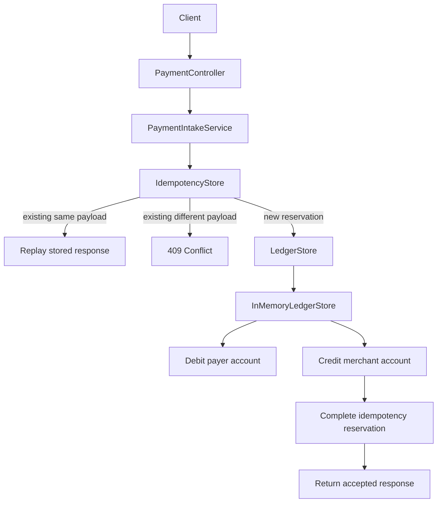

# Design Doc: Idempotent Payment Ledger

## Problem Statement

Clients retry payment requests when networks, gateways, or servers fail ambiguously. A retry can arrive after the original request already mutated state. Without an idempotency boundary, the system can double-charge a payer or create duplicate ledger entries.

This module demonstrates a retry-safe payment intake path with idempotency keys and balanced ledger entries.

## Goals

- Accept payment requests with an `Idempotency-Key`.
- Return the same outcome for duplicate requests with the same key and same payload.
- Reject reuse of the same key with a different payload.
- Record balanced debit and credit ledger entries.
- Keep the first slice small enough to reason about correctness.

## Non-Goals

- Real payment gateway integration.
- Real money movement.
- Durable database implementation in the first slice.
- Multi-tenant auth and risk controls.
- Distributed locks or cross-region idempotency.

## Scale Assumptions

First slice:

- single process;
- in-memory state;
- enough to prove invariants and tests.

Production target:

- many API instances;
- durable idempotency table;
- durable ledger table;
- uniqueness constraint on idempotency key;
- transactional insert of idempotency record, payment record, ledger entries, and outbox event.

## Functional Requirements

- `POST /api/payments` accepts a JSON payment request.
- The caller must send `Idempotency-Key`.
- Same key and same payload returns the original response.
- Same key and different payload returns `409 Conflict`.
- Successful request creates exactly one debit and one credit.
- Invalid request returns `400 Bad Request`.

## Non-Functional Requirements

- Correctness is more important than throughput for the ledger boundary.
- Failure behavior must be explicit.
- The API must be testable without external infrastructure in the first slice.
- The design must be evolvable toward durable storage and outbox.

## Proposed Architecture

This module uses a pragmatic ports-and-adapters layout. The payment intake use case depends on application ports (`IdempotencyStore`, `LedgerStore`), while infrastructure adapters can be swapped between fast in-memory semantics tests and the JPA/PostgreSQL persistence slice. This keeps retry/ledger correctness policy separate from the storage mechanism and makes the database boundary testable without moving persistence concerns into the application service.



Package layout:

```text
api/                  HTTP adapter
application/          orchestration service
application/port/     boundaries the application depends on
domain/               immutable domain records and domain exceptions
infrastructure/       in-memory adapters for the first slice
```

Dependency rule:

```text
api -> application -> application/port
infrastructure -> application/port
application -> domain
infrastructure -> domain
```

The application layer does not depend on concrete infrastructure classes.

## API Design

Request:

```http
POST /api/payments
Idempotency-Key: <stable-client-generated-key>
Content-Type: application/json
```

```json
{
  "payerAccountId": "acct-payer",
  "merchantAccountId": "acct-merchant",
  "amount": 100.00,
  "currency": "USD"
}
```

Response:

```json
{
  "paymentId": "...",
  "ledgerTransactionId": "...",
  "status": "ACCEPTED",
  "amount": 100.00,
  "currency": "USD",
  "replayed": false,
  "processedAt": "2026-05-14T09:00:00Z"
}
```

## Data Model

First slice:

- in-memory idempotency record map;
- in-memory ledger entries.

Production target:

- `idempotency_records(tenant_id, key, payload_hash, request_body, response_body, status, created_at, completed_at, expires_at)`;
- `payments(payment_id, idempotency_key, amount, currency, status, created_at)`;
- `ledger_transactions(transaction_id, payment_id, posting_rule, posting_rule_version, status, created_at)`;
- `ledger_entries(entry_id, transaction_id, account_id, type, amount, currency, created_at)`;
- `outbox_events(event_id, aggregate_id, event_type, payload, created_at, published_at)`.

## Consistency Model

The ledger mutation and idempotency record must be atomic in production. The first slice uses an `IdempotencyStore` abstraction backed by an in-memory reservation map: the winning request reserves the key, records the ledger mutation, then completes the stored outcome; duplicate same-payload requests wait for or replay that outcome.

The production design should rely on a database transaction and a uniqueness constraint on the idempotency key. Distributed locks are not the first choice for the ledger boundary because the database is already the authority for the write.

## Durable Transaction Boundary

The full DDL is in `src/main/resources/db/migration/V1__init_payment_ledger.sql`.
The persistence design decision is recorded in `docs/ADR-001-persistence-schema.md`.

The production transaction commits these five writes atomically:

```sql
BEGIN;
  -- Step 1: claim the idempotency key (race condition guard)
  INSERT INTO idempotency_records (tenant_id, idempotency_key, payload_hash,
      request_body, status, expires_at)
  VALUES (?, ?, ?, ?, 'PROCESSING', now() + interval '7 days');
  -- If a duplicate key exists, Postgres raises a unique constraint violation.
  -- The caller catches this, reads the existing record, and either replays
  -- (status = ACCEPTED) or waits/rejects (status = PROCESSING).

  -- Step 2: write business state
  INSERT INTO payments (payment_id, tenant_id, idempotency_key, ...);
  INSERT INTO ledger_transactions (transaction_id, payment_id, posting_rule, ...);
  INSERT INTO ledger_entries (entry_id, transaction_id, account_id, 'DEBIT',  amount, ...);
  INSERT INTO ledger_entries (entry_id, transaction_id, account_id, 'CREDIT', amount, ...);

  -- Step 3: register outbox event (same transaction — never lost)
  INSERT INTO outbox_events (aggregate_id, event_type, payload, ...);

  -- Step 4: complete the idempotency record
  UPDATE idempotency_records
     SET status = 'ACCEPTED', response_body = ?, completed_at = now()
   WHERE tenant_id = ? AND idempotency_key = ?;
COMMIT;
```

Atomicity rule:

```text
If the ledger mutation commits, the idempotency outcome must also commit.
If the idempotency outcome commits, the ledger mutation must also commit.
```

This prevents the dangerous middle state where a retry cannot tell whether
the original request created ledger side effects.

### Race Condition Strategy

The `UNIQUE (tenant_id, idempotency_key)` constraint is the primary
concurrency control mechanism — not application-level locks.

```
Request A ──► INSERT idempotency_records ──► wins, continues transaction
Request B ──► INSERT idempotency_records ──► unique violation
                                              └─► SELECT existing record
                                                  ├─► PROCESSING → wait or 425
                                                  └─► ACCEPTED   → replay response
```

This is preferred over `SELECT FOR UPDATE` (requires a prior SELECT) and Redis
locks (adds a failure domain without stronger atomicity guarantees).

### Index Strategy

```
idempotency_records: (tenant_id, idempotency_key)  — lookup on every request
idempotency_records: (expires_at) WHERE ACCEPTED   — TTL cleanup job
payments:            (tenant_id, idempotency_key)  — reconciliation
payments:            (payer_account_id, created_at DESC)    — payer statement
payments:            (merchant_account_id, created_at DESC) — merchant settlement
ledger_transactions: (payment_id)                  — forward join
ledger_entries:      (transaction_id)              — balance check
ledger_entries:      (account_id, created_at DESC) — account history
outbox_events:       (created_at) WHERE published_at IS NULL — poller scan
```

Uniqueness boundary:

```text
UNIQUE (tenant_id, idempotency_key)
```

The first implementation may use a single-tenant key, but the design remains
tenant-scoped because idempotency keys are caller-generated and must not
collide globally across tenants.

## Posting Rule Boundary

The current first slice creates a debit and credit pair directly inside the in-memory ledger adapter. That is acceptable for proving the first invariant, but production code should introduce an explicit posting rule boundary:

```text
PaymentIntakeService
  -> PostingRule / LedgerPostingService
  -> LedgerStore
```

For the initial payment event:

```text
PAYMENT_ACCEPTED:
  debit  payer account
  credit merchant account
```

The ledger boundary should validate that every generated `ledger_transaction` balances before persistence. Future rule changes should be versioned, audited, and tied to the generated ledger transaction.

## Alternatives Considered

### Client-only retries

Rejected. The server cannot trust clients to infer whether a timed-out request committed.

### Store only payment id by idempotency key

Insufficient. The system must also bind the key to a payload hash to reject accidental or malicious key reuse.

### Distributed lock around request processing

Deferred. A durable uniqueness constraint is simpler and more authoritative for the payment write boundary.

### Single Postgres transaction

Preferred for the next slice. Payment state, idempotency outcome, ledger transaction, ledger entries, and outbox row can be committed under one source of truth.

### Redis lock plus database write

Not the default. A Redis lock can reduce duplicate pressure before the database, but it does not replace the database uniqueness constraint. If Redis succeeds and the database fails, the database remains the authority.

### Event-sourced ledger as the first persistence slice

Deferred. Event sourcing is powerful for audit and replay, but it adds modeling and operational complexity before the basic transaction boundary is proven.

## Trade-Off Analysis

The first slice chooses in-memory storage for fast learning and testability. This is not production-ready, but it lets the module prove the core semantics before adding persistence.

The next slice should replace in-memory maps with durable tables and transaction boundaries.

The key trade-off is speed of learning versus production realism. Starting in memory made the invariants easy to inspect. The next milestone must now shift pressure to durable state so failure tests can prove behavior across the same boundary that production would rely on.

## Open Questions

- How long should idempotency records live?
- Should idempotency keys be scoped by tenant/account?
- How should the API expose pending/in-progress outcomes?
- What reconciliation job proves ledger/payment consistency after partial failures?
- Which events belong in the transactional outbox?
