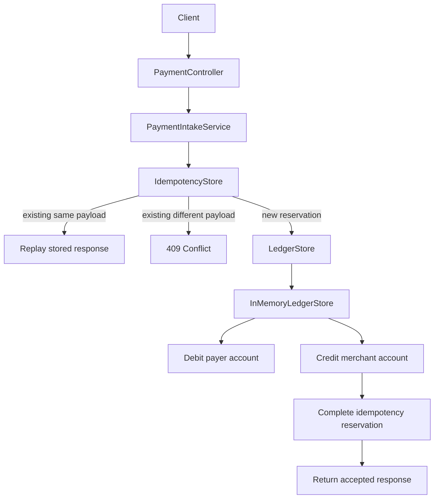

# Design Doc: Idempotent Payment Ledger

## Problem Statement

Clients retry payment requests when networks, gateways, or servers fail ambiguously. A retry can arrive after the original request already mutated state. Without an idempotency boundary, the system can double-charge a payer or create duplicate ledger entries.

This module demonstrates a retry-safe payment intake path with idempotency keys and balanced ledger entries.

## Goals

- Accept payment requests with an `Idempotency-Key`.
- Return the same outcome for duplicate requests with the same key and same payload.
- Reject reuse of the same key with a different payload.
- Record balanced debit and credit ledger entries.
- Keep the first slice small enough to reason about correctness.

## Non-Goals

- Real payment gateway integration.
- Real money movement.
- Durable database implementation in the first slice.
- Multi-tenant auth and risk controls.
- Distributed locks or cross-region idempotency.

## Scale Assumptions

First slice:

- single process;
- in-memory state;
- enough to prove invariants and tests.

Production target:

- many API instances;
- durable idempotency table;
- durable ledger table;
- uniqueness constraint on idempotency key;
- transactional insert of idempotency record, payment record, ledger entries, and outbox event.

## Functional Requirements

- `POST /api/payments` accepts a JSON payment request.
- The caller must send `Idempotency-Key`.
- Same key and same payload returns the original response.
- Same key and different payload returns `409 Conflict`.
- Successful request creates exactly one debit and one credit.
- Invalid request returns `400 Bad Request`.

## Non-Functional Requirements

- Correctness is more important than throughput for the ledger boundary.
- Failure behavior must be explicit.
- The API must be testable without external infrastructure in the first slice.
- The design must be evolvable toward durable storage and outbox.

## Proposed Architecture

This module uses a pragmatic ports-and-adapters layout. The payment intake use case depends on application ports (`IdempotencyStore`, `LedgerStore`), while the first slice provides in-memory infrastructure adapters. This keeps retry/ledger correctness policy separate from the storage mechanism and gives the module a clean path toward Postgres-backed persistence.



Package layout:

```text
api/                  HTTP adapter
application/          orchestration service
application/port/     boundaries the application depends on
domain/               immutable domain records and domain exceptions
infrastructure/       in-memory adapters for the first slice
```

Dependency rule:

```text
api -> application -> application/port
infrastructure -> application/port
application -> domain
infrastructure -> domain
```

The application layer does not depend on concrete infrastructure classes.

## API Design

Request:

```http
POST /api/payments
Idempotency-Key: <stable-client-generated-key>
Content-Type: application/json
```

```json
{
  "payerAccountId": "acct-payer",
  "merchantAccountId": "acct-merchant",
  "amount": 100.00,
  "currency": "USD"
}
```

Response:

```json
{
  "paymentId": "...",
  "ledgerTransactionId": "...",
  "status": "ACCEPTED",
  "amount": 100.00,
  "currency": "USD",
  "replayed": false,
  "processedAt": "2026-05-14T09:00:00Z"
}
```

## Data Model

First slice:

- in-memory idempotency record map;
- in-memory ledger entries.

Production target:

- `idempotency_records(key, payload_hash, request_body, response_body, status, created_at)`;
- `payments(payment_id, idempotency_key, amount, currency, status, created_at)`;
- `ledger_entries(entry_id, transaction_id, account_id, type, amount, currency, created_at)`;
- `outbox_events(event_id, aggregate_id, event_type, payload, created_at, published_at)`.

## Consistency Model

The ledger mutation and idempotency record must be atomic in production. The first slice uses an `IdempotencyStore` abstraction backed by an in-memory reservation map: the winning request reserves the key, records the ledger mutation, then completes the stored outcome; duplicate same-payload requests wait for or replay that outcome.

The production design should rely on a database transaction and a uniqueness constraint on the idempotency key. Distributed locks are not the first choice for the ledger boundary because the database is already the authority for the write.

## Alternatives Considered

### Client-only retries

Rejected. The server cannot trust clients to infer whether a timed-out request committed.

### Store only payment id by idempotency key

Insufficient. The system must also bind the key to a payload hash to reject accidental or malicious key reuse.

### Distributed lock around request processing

Deferred. A durable uniqueness constraint is simpler and more authoritative for the payment write boundary.

## Trade-Off Analysis

The first slice chooses in-memory storage for fast learning and testability. This is not production-ready, but it lets the module prove the core semantics before adding persistence.

The next slice should replace in-memory maps with durable tables and transaction boundaries.

## Open Questions

- How long should idempotency records live?
- Should idempotency keys be scoped by tenant/account?
- How should the API expose pending/in-progress outcomes?
- What reconciliation job proves ledger/payment consistency after partial failures?
- Which events belong in the transactional outbox?
